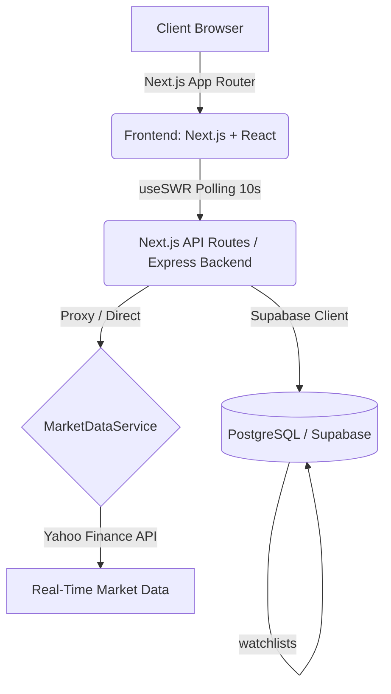

#  Smart Watchlist - Code, By Groww

An intelligent, real-time stock watchlist platform featuring automated "Meaningful Change" detection, dual-currency tracking (INR / USD), interactive card stack & grid interfaces, and integrated market news.

## 🔗 Live Links
- **GitHub Repository**: [https://github.com/shivvangi/Code_by_Groww_Shivangi_Singh](https://github.com/shivvangi/Code_by_Groww_Shivangi_Singh)
- **Live Demo (Vercel)**: [https://code-by-groww-shivangi-singh.vercel.app](https://code-by-groww-shivangi-singh.vercel.app)
- **Demo Video**: `[Insert Demo Video Link Here]`

---

## 🌟 Key Features

1. **Intelligent "Meaningful Change" Detection**: 
   Automatically flags and prioritizes stocks in your watchlist that require immediate attention:
   - **Volume Spike**: Current trading volume exceeds $1.5\times$ the 10-day average volume.
   - **Price Drift**: Price moved $\ge 2\%$ since the user's previous session/view.

2. **Smart Sorting & Dynamic Prioritization**: 
   - **Needs Attention**: Stocks flagged with meaningful changes instantly jump to the top.
   - **Recently Added**: Newly added stocks (within 5 minutes) bypass regular sorting and snap to the absolute top.
   - **Chronological**: All other stocks are elegantly sorted by the time they were added (newest first).

3. **Dual Currency Conversion**: 
   Toggle between **USD ($)** and **INR (₹)** on the fly with live exchange rate integration fetching the latest Forex data.

4. **Interactive Views**:
   - **Bento Grid Layout**: A gorgeous, dynamic grid system highlighting market indices, how it works, and your watchlist.
   - **Stack View**: Fluid, gesture-friendly 3D card stack navigation powered by Framer Motion.
   - **Grid View**: Comprehensive overview displaying all tracked equities at a glance.

5. **Live Market News & Sparkline Trends**: 
   Real-time 7-day interactive price history charts and curated news for your tracked tickers.

---

## 🏗️ Architecture & Diagram

The application is built using a modern decoupled architecture. The frontend strictly fetches from its own API routes or the dedicated backend API, utilizing `useSWR` for high-frequency real-time polling (every 10 seconds).



### Directory Structure

```
grow_hack/
├── backend/                  # Express + TypeScript API Server
│   ├── src/
│   │   ├── routes/           # Watchlist, search, & news routes
│   │   ├── services/         # Yahoo Finance integration & change analysis
│   │   └── supabase.ts       # Supabase database client
│   ├── .env.example          
│   └── package.json
│
├── frontend/                 # Next.js 16 + React 19 Frontend (Turbopack)
│   ├── src/
│   │   ├── app/              # App Router pages, global styles, Next API routes
│   │   ├── components/       # UI Components (Bento Grid, Card Stack, etc.)
│   │   └── lib/              # API client (Axios), Supabase helpers, marketData logic
│   ├── .env.local.example    
│   └── package.json
│
└── supabase_schema.sql       # Database schema and RLS policies
```

---

## 🧪 Test Cases Considered & Run

Comprehensive testing strategies were implemented to ensure real-time accuracy and resilient UI rendering:

### Functional Testing
1. **API Polling & Cache**: Verified that `useSWR` polls every 10 seconds and backend cache TTL is properly configured to 10 seconds so the frontend receives fresh market data without hitting Yahoo Finance rate limits.
2. **Dynamic Sorting Verification**: 
   - *Test:* Add a new stock -> *Result:* Immediately snaps to position #1.
   - *Test:* Add two new stocks within 5 minutes -> *Result:* The second stock strictly sorts above the first.
   - *Test:* Wait 5 minutes for "new" flag to expire on a volatile stock -> *Result:* Stock correctly falls back to "Needs Attention" priority over non-volatile stocks.
3. **Currency Toggling**: Verified that switching to INR mathematically scales the price, 52W High/Low, and Market Cap correctly using the live USD/INR FX rate.

### Component Rendering Tests
1. **Bento Grid & CSS Modules**: Tested `HowItWorks.module.css` to ensure grid fallback gracefully degrades on mobile viewports.
2. **Animation Lifecycles**: Validated Framer Motion presence attributes in the `CardStack` component to prevent memory leaks during rapid card swiping.

### Backend/Database Integration
1. **Session Tracking**: Verified that `last_viewed_at` timestamps correctly log the user's session time to calculate accurate historical baseline prices for the "Price Drift" meaningful metric.
2. **Row Level Security (RLS)**: Ensured users can only fetch, insert, and delete tickers tied to their explicit `user_id`.

---

## 🚀 Getting Started

### Prerequisites
- Node.js (v18+ recommended)
- npm or yarn

### 1. Database Setup (Supabase)
Run the queries in `supabase_schema.sql` inside your Supabase project's SQL Editor to initialize the database with RLS policies.

### 2. Backend Setup
```bash
cd backend
npm install
cp .env.example .env

# Start development server
npm run dev
```

### 3. Frontend Setup
```bash
cd frontend
npm install
cp .env.local.example .env.local

# Start Next.js development server
npm run dev
```

Visit **[http://localhost:3000](http://localhost:3000)** in your browser!
